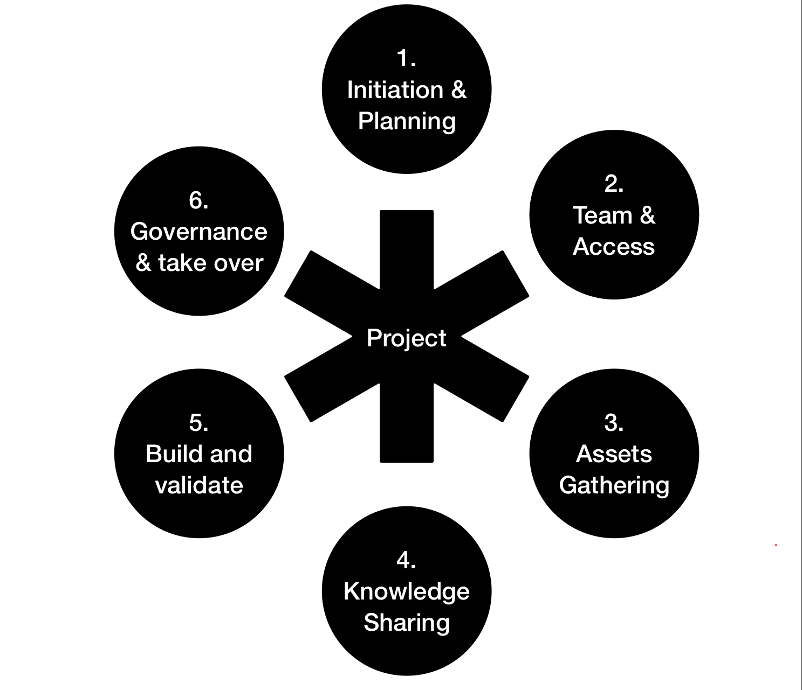

# PTEF : Project Transition Enterprise Framework
A component based modular enterprise framework for project transition.

Before starting you must understand the modular and agile nature of PTT framework. It is recommended that you could define every phase and every components as per project demand. Nothing is here that could not be altered. Feel free to design your own components and inherits what fits best to you.
## 1. Framework initiation and planning 
This phase includes initiation of all components and end to end plan for project transition in place. 
** this framework support agile methodology so feel free to use with every phase and component.

Output : Transition plan, Components

## 2. Team & Access 
Includes access to all mentioned assets components in phase 1. Also states the team structure  during and after transition. Further details will be a part of access component in phase 3.

Output : Team structure, Access plan

## 3. Assets Gathering
Includes gathering of all assets and store in repository components.

Output :

**Assets component - ownership of assets**

| Application C | Source Code, App Architecture, Dependencies checklist, Configurations |
| --- | --- |
| Data C | Data flow, Data/systems Architecture |
| Services &amp; Solutions C | Products and solutions integrated info and architecture, Integration Architetcure |
| Documents C | SOPs, Setup &amp; Deployment guide, Certificates, Credentials, SDD |
| Platform C | Platform Architecture, Platform Configurations, Setup and deploy guide |
| Others C | Change list, Issue list, Todo list, Impact assessment list, Backup plan, Quality docs |

\*\*. Feel free to add/update components and corresponding assets as it should be as per your project requirements.

**Tags component - classification and stage**

Define tags and assign to add further information to any component.

| Components | C |
| --- | --- |
|Application|App|
|Repository|R|

**Access components - access to any specific component**

**Repository component - holds every component related information**

- Source code repository R
- Change repository R
- Document repository R
- Quality docs repository R

**Communication component**

- Communication plan
- KT plan

**Action components**

- Retiring old team access after handover and takeover
- Raising requests for access to all team members

## 4. Knowledge Sharing
Includes knowledge transition plan.

Output :
- Recorded sessions 
- Documents

## 5. Build, Validate & Run
Includes project setup, end to end validation including project running in all environments.

Output :
- Setup and deployment procedure
- Quality check
- Organization principals and security checklist validation

## 6. Governance and Takeover
This phase includes implementation of governance with roles and responsibilities. Finally, execution of handover and takeover as per organization process takes place.

Output :
- Maintenance and operations plan
- Support activities
- New Team 
- Retire old team

